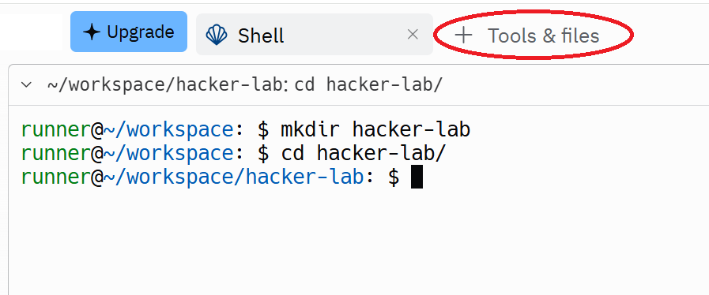
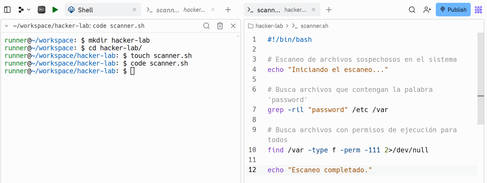

# 💻 ¡Bienvenido al mundo del shell! en Unix/Linux

## ¿Qué es la shell?

Las interfaces `gráficas`, de `voz` y `AR/VR` (Augmented Reality/Virtual Reality) son limitadas. Para un control **total** sobre tu computadora, la línea de comandos (`shell`) es la solución. Ofrece flexibilidad y permite realizar tareas imposibles con otras interfaces.

Todas las plataformas tienen una `shell`, a menudo varias. Estas te permiten ejecutar programas y manejar su entrada y salida. En este curso, usaremos `Bourne Again SHell`, o `bash` para abreviar, una de las shells más comunes. Para empezar, necesitas un terminal, donde escribirás los comandos y para ello haremos uso del shell en `replit.com`.

* **¿Qué es Replit?** Una plataforma de desarrollo en línea que te permite escribir, ejecutar y compartir código en diversos lenguajes, incluido Bash.
  
* **¿Por qué usar Replit para aprender shell?** Es fácil de usar, gratuito y te permite experimentar sin riesgos.

* **¿Porque se le llama shell?** El término `shell` se utiliza porque la línea de comandos actúa como una capa exterior o envoltorio (shell en inglés) que te permite interactuar con el sistema operativo de una manera más poderosa, sin limitaciones.

Para abrir un **prompt** de shell (donde puedes escribir comandos), primero necesitas un **terminal**. 

## Creando nuestro primer Replit App

1. **Crea una nueva App:** Haz clic en el botón "Create" y selecciona "Bash".
2. **Explora la interfaz:** El editor a la izquierda para escribir código y a la derecha se encuentra la shell para ejecutar comandos.

## Explorando el Shell de Replit

* **El prompt:** Es el símbolo que indica que el shell está listo para recibir comandos (por ejemplo, `$`).

### ¿Se puede personalizar el prompt?

 **¡Sí, puedes personalizar tu prompt a tu gusto!** La variable de entorno `PS1` es la clave para esto. Modificándola, puedes agregar colores, mostrar información adicional como tu nombre de usuario, el nombre del host, el directorio actual, e incluso la hora. 
 
 ### Ejemplos

1. Cambiar el prompt para que salga siempre el texto "hola mundo":

```bash
PS1='hola mundo $ '
```

2. Cambiar el prompt para que aparezca el nombre del usuario y el directorio actual:
```bash
PS1='\u@\w$ '
```
3. Lo mismo que el anterior pero que el usuario aparezca en verde y el directorio actual en azul:

```bash
PS1='\[\033[0;32m\]\u\[\033[0m\]@\[\033[0;34m\]\w\[\033[0m\]: $ '
```

4. Mostrar la hora y fecha actual en color magenta:

```bash
PS1='\[\033[1;35m\]\t \d\[\033[0m\] $ '
```

* **Experimenta:** Prueba diferentes combinaciones hasta encontrar el prompt que te guste. Aca un resumen de los comandos que puedes utilizar y los colores.

  
* **Guarda los cambios:** Recuerda guardar los cambios en tu archivo `.bashrc` para que el nuevo prompt se aplique cada vez que inicies una nueva sesión de terminal.

| Secuencia | Descripción | Ejemplo en el prompt |
|---|---|---|
| \u | Nombre de usuario actual | `[\u@\h]` → [usuario@host] |
| \h | Nombre abreviado del host | `[\u@\h]` → [usuario@host] |
| \H | Nombre completo del host (FQDN) | `[\H]` → [hostname.dominio] |
| \w | Directorio de trabajo actual | `\w\$` → ~/proyecto$ |
| \W | Directorio de trabajo actual sin path completo | `\W\$` → proyecto |
| \$ | Símbolo $ para usuarios normales, # para root | `\$` → $ o # |
| \! | Número del comando actual | `Comando \!` → Comando 23 |
| \d | Fecha en formato "día_sem mes día" | `\d` → dom nov 18 |
| \n | Nueva línea | Para crear saltos de línea en el prompt |
| \t | Hora actual en formato 24 horas | `\t` → 14:32:01 |
| \T | Hora actual en formato 12 horas | `\T` → 02:32:01 PM |
| \v | Versión de Bash | `Bash \v` → Bash 5.1.8(1)-release |
| \s | Shell (bash, zsh, etc.) | `\s` → bash |
| \l | Nombre del terminal | Puede variar según la distribución |

¡Claro! Aquí tienes una tabla resumida con los códigos de colores y efectos de texto más comunes para personalizar tu prompt en Bash:

### Colores de texto
| Código | Color |
|---|---|
| `\033[30m` | Negro |
| `\033[31m` | Rojo |
| `\033[32m` | Verde |
| `\033[33m` | Amarillo |
| `\033[34m` | Azul |
| `\033[35m` | Magenta |
| `\033[36m` | Cyan |
| `\033[37m` | Blanco |

### Colores de fondo
| Código | Color |
|---|---|
| `\033[40m` | Fondo negro |
| `\033[41m` | Fondo rojo |
| `\033[42m` | Fondo verde |
| `\033[43m` | Fondo amarillo |
| `\033[44m` | Fondo azul |
| `\033[45m` | Fondo magenta |
| `\033[46m` | Fondo cyan |
| `\033[47m` | Fondo blanco |

### Estilos de texto
| Código | Estilo |
|---|---|
| `\033[1m` | Negrita |
| `\033[2m` | Débil (menos intenso) |
| `\033[3m` | Cursiva |
| `\033[4m` | Subrayado |
| `\033[5m` | Parpadeante (en algunas terminales)|
| `\033[7m` | Invertido (blanco sobre negro) |
| `\033[8m` | Oculto |
| `\033[9m` | Rayado |
| `\033[21m` | Doble subrayado |

### Otros comandos

En el prompt del shell, puedes escribir comandos que serán interpretados por el sistema. Por ejemplo, el comando `date` muestra la fecha y hora actual:

```bash
date
```

**Salida**
> Fri 10 Jan 2024 12:49:01 AM EST

También puedes ejecutar comandos con argumentos:

```bash
echo hola
```

**Salida**
> hola

Pero, **¿cómo sabe el shell cómo encontrar los programas `date` o `echo`?** Bueno, el shell es un entorno de programación, como Python o C, por lo que tiene variables, condicionales, bucles y funciones. Cuando ejecuta comandos en su shell, en realidad está escribiendo un pequeño fragmento de código que su shell interpreta. Si se le pide al shell que ejecute un comando que no coincide con una de sus palabras clave de programación, consulta una variable de entorno llamada $PATH que enumera en qué directorios debe buscar programas el shell cuando recibe un comando:

```bash
echo $PATH
```

**Salida**
> /usr/local/sbin:/usr/local/bin:/usr/sbin:/usr/bin:/sbin:/bin

```bash
which date
```

**Salida**
> /bin/date

Cuando ejecutamos el comando `echo`, el shell ve que debe ejecutar el programa echo y luego busca en la lista de directorios separados por : en $PATH un archivo con ese nombre. Cuando lo encuentra, lo ejecuta (suponiendo que el archivo sea ejecutable). Podemos averiguar qué archivo se ejecuta para un nombre de programa determinado utilizando `which`. También podemos omitir $PATH por completo proporcionando la ruta al archivo que queremos ejecutar.

## Navegando en el Shell

Un **path** en el shell es una lista de directorios separados por `/` (Linux y macOS) o `\` (Windows). 

El directorio raíz es `/` en Linux/macOS y `C:\` en Windows (para el disco duro C).

Un **path absoluto** comienza con `/` y especifica la ubicación exacta de un archivo o directorio desde la raíz del sistema de archivos. Un **path relativo** se basa en el directorio actual, indicado por `pwd`.

Los comandos básicos para navegar son:

* **`pwd`**: Muestra el directorio actual.
* **`cd`**: Cambia el directorio actual.

* **`.`** representa el directorio actual.
* **`..`** representa el directorio padre.
* **`~`** representa el directorio HOME

**Ejemplo:**

```bash
pwd
```

**Salida**

> /home/runner/workspace

```bash
cd /home
```

```bash
pwd
```

**Salida**

> /home

```bash
cd ..
```

```bash
pwd
```

**Salida**

> /

```bash
cd ./home
```

```bash
pwd
```

**Salida**

> /home

```bash
cd runner
```

```bash
pwd
```

**Salida**

> /home/runner

```bash
../../bin/echo hola  
```

**Salida**

> hola

---

El carácter `~` en Bash representa tu directorio home.

Es decir, cuando escribes `cd ~` en la terminal y presionas Enter, automáticamente te lleva al directorio donde se encuentran tus archivos personales. 

**Ejemplo:**

Si tu usuario es `runner` y tu directorio home está en `/home/runner`, al escribir `cd ~` en la terminal estarás ejecutando el comando `cd /home/runner`

La variable donde se guarda el contenido de tu directorio home es la variable `$HOME` y la puedes consultar con el siguiente commando 

```bash
echo $HOME
```

**Salida**

> /home/runner

También puedes usar `~` como un atajo para ir a tu directorio home:

```bash
cd ~
```

```bash
pwd
```

**Salida**

> /home/runner

Para listar los archivos y directorios en un directorio, usa el comando `ls`. Puedes agregar opciones como `-l` para obtener una lista detallada.

```bash
ls
```

```bash
cd ..
```

```bash
ls
```

```bash
cd /
```

```bash
ls
```

**Salida**

> bin home boot dev etc home ...

La mayoría de los comandos aceptan opciones que modifican su comportamiento. Usa `-h` o `--help` para obtener ayuda sobre un comando específico.

**Ejemplo de salida del comando `ls -l`:**

```bash
cd /home
ls -l
```

**Salida**

>drwxr-xr-x 1 runner runner 58 Aug 13 22:23 runner

* El primer carácter indica el tipo de archivo: `d` para directorio, `-` para archivo normal.
* Los siguientes tres grupos de tres caracteres indican los permisos de lectura (r), escritura (w) y ejecución (x) para el propietario, el grupo y todos los demás usuarios, respectivamente.
* Un `-` indica que no se tiene el permiso correspondiente.
* En el ejemplo anterior, solo el propietario puede modificar (añadir/eliminar archivos) el directorio `runner`. Para entrar a un directorio, un usuario debe tener permiso de "búsqueda" (representado por "ejecutar": `x`) en ese directorio (y sus directorios padre). Para listar su contenido, un usuario debe tener permisos de lectura (`r`) en ese directorio. 

Ten en cuenta que casi todos los archivos en `/bin` tienen el permiso `x` establecido para el último grupo, "todos los demás", para que cualquiera pueda ejecutar esos programas.

Hay otros comandos útiles para gestionar archivos y directorios:

* `mv`: renombrar o mover un archivo
* `cp`: copiar un archivo
* `mkdir`: crear un nuevo directorio

## Conectando programas

En el shell, los programas tienen dos "flujos" principales asociados: el flujo de entrada y el flujo de salida.  El programa lee del flujo de entrada y escribe en el flujo de salida. Normalmente, la entrada y salida de un programa son tu terminal (teclado como entrada y pantalla como salida). Sin embargo, ¡también podemos redirigir esos flujos!

La forma más simple de redirección es `< archivo` y `> archivo`. Estos permiten redirigir el flujo de entrada y salida de un programa a un archivo, respectivamente:

Podemos redirigir la salida de un comando hacia un archivo usando `>`:

```bash
echo hello > hello.txt
````

Ahora, si mostramos el contenido del archivo con `cat`:

```bash
cat hello.txt
```

**Salida**

> hello

También podemos redirigir la entrada desde un archivo con `<` y al mismo tiempo la salida hacia otro archivo con `>`:

```bash
cat < hello.txt > hello2.txt
```

Si leemos el nuevo archivo:

```bash
cat hello2.txt
```

**Salida**

> hello

En el ejemplo anterior, `cat` es un programa que concatena archivos. Cuando se le proporcionan nombres de archivo como argumentos, imprime el contenido de cada uno de los archivos en secuencia a su flujo de salida. Pero cuando a `cat` no se le proporciona ningún argumento, imprime el contenido de su flujo de entrada a su flujo de salida.


  <details><summary>🎩Truco</summary>

intente entender que pasa cuando escribes `cat > archivo.txt`. Para terminar de ingresar datos debes presionar `Ctrl-D`. Siempre tienes la opción de preguntarle a Profesorcito. 

</details>

También puedes usar la doble flecha `>>` para **agregar contenido** a un archivo. El verdadero potencial de la redirección de entrada/salida se muestra cuando se usan **tuberías**. El operador `|` te permite **encadenar programas** de forma que la salida de uno se convierte en la entrada del otro.

Aquí tienes algunos ejemplos:

Por ejemplo, este comando lista los archivos del directorio raíz `/` en formato detallado y luego muestra **solo la última línea**:

```bash
cd /bin
````
```bash
ls -l
````

```bash
ls -l | tail -n1
````

**Salida**

> -rwxr-xr-x 1 root   root       4577 Apr  8  2024 znew

---

Otro ejemplo: con `curl --head` obtenemos las cabeceras de una página web.
Si filtramos con `grep`, podemos mostrar solo la línea que contiene la longitud del contenido:

```bash
curl --head --silent google.com | grep Length
```

**Salida**

> Content-Length: 219

Ya que mencionamos `curl`, aprendamos un poco de el:

Aprovechando que hablamos de `curl`, profundicemos un poco en el comando y veamos cómo funciona.

### Entendiendo Curl 

`Curl` es una herramienta de línea de comandos versátil, ampliamente utilizada para transferir datos a través de una variedad de protocolos de red. Creada en 1997 por Daniel Stenberg. Su nombre, `curl`, es un acrónimo de `client URL` y refleja su función principal de interactuar con recursos en la web. 

**Ejemplos:**

```bash
cd ~/workspace
```

```bash
curl -o logo_wikimedia.png https://upload.wikimedia.org/wikipedia/commons/6/63/Wikipedia-logo.png
```

En este ejemplo, el comando `curl` está descargando el logotipo de Wikipedia (un archivo PNG) desde la URL especificada y guardándolo en un archivo local llamado "logo_wikimedia.png". 

* `curl`: Invocador del comando curl.
* `-o logo_wikimedia.png`: Opción para especificar el nombre del archivo de salida donde se guardará el contenido descargado.
* `https://upload.wikimedia.org/wikipedia/commons/6/63/Wikipedia-logo.png`: La URL del recurso que se desea descargar (en este caso, el logotipo de Wikipedia).

La siguiente imagen muestra el logotipo descargado para ilustrar el resultado del uso del comando curl en el ejemplo anterior:

<p align="center">
  
</p>

```bash
curl -o Calendario-AcadAdm2025.pdf https://www.javerianacali.edu.co/sites/default/files/2025-05/Calendario-AcadAdm2025.pdf
```
Este comando hace lo siguiente:

1. **Se conecta:** El comando se conecta al servidor web de la Universidad Javeriana de Cali.
2. **Solicita:** Solicita específicamente el archivo PDF del calendario académico de 2025.
3. **Descarga:** Descarga el archivo y lo guarda en tu computadora con el nombre "Calendario-AcadAdm2025.pdf".

## Una herramienta versátil y potente

En la mayoría de los sistemas similares a Unix, hay un usuario especial: el usuario **root**. Es posible que lo hayas visto en los listados de archivos anteriores. El usuario root tiene permisos por encima de (casi) todas las restricciones de acceso y puede crear, leer, actualizar y eliminar cualquier archivo del sistema. Sin embargo, no iniciarás sesión normalmente en tu sistema como usuario root, ya que es muy fácil romper algo accidentalmente. En su lugar, utilizarás el comando `sudo`. Como su nombre indica, te permite "hacer" algo "como su" (abreviatura de "superusuario" o "root"). Si recibes errores de permiso denegado, suele ser porque necesitas hacer algo como root.

En `replit` el uso de `sudo` es restringido. 

&nbsp;

<p align="center">
  
</p>

# Taller de Shell: Exploración y Análisis con Scripts Bash

En este taller, crearás un script que buscará y analizará archivos específicos en tu sistema, buscando patrones de texto que podrían indicar comportamientos sospechosos o archivos ocultos. Este ejercicio es ideal para aquellos que buscan afinar sus habilidades en Bash y obtener una visión más profunda del sistema.

## 1. Preparación del Entorno

### Paso 1. Abrir un Repl o crear uno nuevo. Por ejemplo, pensemos que tu repl se llama ABC

### Paso 2. En el panel de la derecha buscar el shell o dar click en `+` y escoger `shell`

### Paso 3: Crear un Directorio de Trabajo
Primero, crea un directorio donde trabajarás en este taller.

```bash
cd ~/workspace
```

```bash
mkdir hacker-lab
cd hacker-lab
```
<p align="center">
  
</p>

### Paso 4: Crear un Archivo con `touch`
Crea un archivo vacío llamado `scanner.sh` que será tu script principal.

```bash
touch scanner.sh
```

## 2. Escribiendo el Script

### Paso 5: Editar el Script
Abre el archivo `scanner.sh` utilizando el editor de `replit` utilizando el comando `code scanner.sh` y escribe el siguiente código:

```bash
#!/bin/bash

# Escaneo de archivos sospechosos en el sistema
echo "Iniciando el escaneo..."

# Busca archivos que contengan la palabra 'password'
grep -ril "password" /etc /var

# Busca archivos con permisos de ejecución para todos
find /var -type f -perm -111 2>/dev/null

echo "Escaneo completado."
```

<p align="center">
  
</p>


### Explicación del Script:
- `grep -ril "password" /etc /var`: Busca archivos que contengan la palabra "password" en los directorios `/etc`, y `/var`.
- `find /var -type f -perm -111 2>/dev/null`: Busca archivos con permisos de ejecución para todos (permiso 111) dentro de /var.

## 3. Cambio de Permisos y Ejecución del Script

### Paso 6: Hacer el Script Ejecutable
Cambia los permisos del script para que pueda ejecutarse.

```bash
chmod +x scanner.sh
```

### Paso 7: Ejecutar el Script
Ejecuta el script y analiza los resultados.

```bash
./scanner.sh
```

## 4. Análisis de Resultados

### Paso 8: Interpretar la Salida
- Revisa los archivos listados por `grep` para ver si contienen información sensible como contraseñas.
- Examina los archivos ejecutables encontrados por `find` y evalúa si presentan algún riesgo de seguridad.

## 5. Desafío Adicional (Opcional)

### Paso 9: Mejorar el Script
Modifica el script para que los resultados se guarden en un archivo de registro `scan_report.txt` y que cada búsqueda se ejecute en segundo plano usando `&`.

```bash
#!/bin/bash

echo "Iniciando el escaneo..." > scan_report.txt

# Busca archivos que contengan la palabra 'password'
grep -rils "password" /etc /var >> scan_report.txt &

# Busca archivos con permisos de ejecución para todos
find /var -type f -perm -111 2>/dev/null >> scan_report.txt &

echo "Escaneo completado. Revisa el archivo scan_report.txt para los resultados."
```