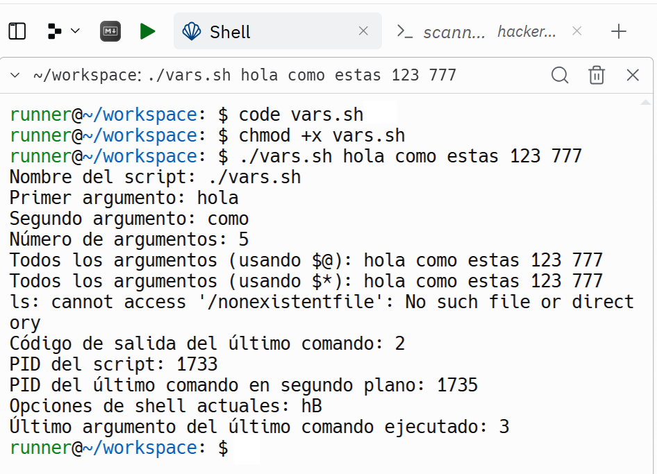

# 💻 Dominando la Shell: Tu Guía Definitiva para Scripting Bash en Unix/Linux

## Shell Scripting

¿Te acuerdas de la primer tema cuando aprendimos a ejecutar comandos en la terminal de `bash`? ¡Genial! Los `scripts` nos permiten llevar eso al siguiente nivel. En vez de escribir cada comando una y otra vez, podemos guardarlos en un archivo y ejecutarlos todos juntos. Es como crear una receta para que la computadora siga.

<details><summary>💡Hint: ¿Por qué se llama "script"?</summary>
  
En español, `script` se traduce comúnmente como **"guion"**. Originalmente, un `script` era algo que se escribía a mano, como un *guion de teatro* 🎭 o un *conjunto de instrucciones* 📋. La idea clave es que un script es una pequeña "obra de teatro" o una "receta" que la computadora sigue paso a paso.
</details>

<details><summary>💡Hint: ¿En MS-DOS se llama igual?</summary>

En MS-DOS se utilizan los términos `script` y `batch file` (archivo por lotes) de manera intercambiable. Un archivo por lotes en MS-DOS es esencialmente un script que contiene una serie de comandos DOS que se ejecutan secuencialmente.

</details>

A continuación examinaremos los siguientes ejemplos de scripts:
1. `mkcd.sh`
2. `mcd.sh`
3. `safe_mcd.sh`
4. `vars.sh`
5. `genesis.sh`
6. `docninja.sh`

---

## Ejemplo #1: `mkcd.sh` como Script Independiente

Este script crea un directorio con el nombre proporcionado y luego cambia al directorio recién creado. Para que funcione correctamente en tu shell actual, sigue los pasos:

```bash
#!/bin/bash
mkdir -p "$1"
cd "$1"
```

**1. Crear el archivo `mkcd.sh`:**
   * Para crear el archivo `mkcd.sh`, escribe `code mkcd.sh` en el shell. En el editor, escribe el código que se muestra arriba.

  <details><summary>💡 Hint: Guardado automático en Replit</summary>

  Cada vez que realizas una modificación en un archivo en Replit, el sistema detecta el cambio y lo guarda automáticamente en la nube, asegurando que no pierdas tu trabajo.
  </details>

**2. Cambiar los permisos:**
   * En la terminal, otorga permisos de ejecución al archivo con el siguiente comando:

   ```bash
   chmod +x mkcd.sh
   ```

**3. Ejecutar el script:**
   * Para ejecutar el script, usa el siguiente comando:

   ```bash
   ./mkcd.sh test
   ```

   Si te fijas, este comando crea el directorio llamado `test`, pero no cambia al nuevo directorio en tu shell actual. Esto ocurre porque el script `mkcd.sh` se ejecuta en un subshell (otro bash), y el `cd` se realiza en ese entorno separado. Al finalizar la ejecución del script, vuelves al shell original sin ver los cambios de directorio.

   Para que `cd` funcione en tu shell actual, debes ejecutar el script así:

   ```bash
   . ./mkcd.sh test
   ```

   Esto ejecutará el script dentro del shell actual, creando el directorio y cambiando a él correctamente.

---

## Ejemplo #2: `mcd.sh` como Función

A continuación, veremos otra forma de lograr la misma tarea con un enfoque diferente: crear el script como una función y cargarla en el shell con `source`. Esto permite que los cambios del comando `cd` afecten directamente al shell actual, facilitando el uso repetido sin necesidad de reescribir comandos.

Este script define una función `mcd()` que crea un directorio y cambia al directorio recién creado. La función debe cargarse en el shell para ser usada como un comando:

```bash
mcd() {
    mkdir -p "$1"
    cd "$1"
}
```

**1. Crear el archivo `mcd.sh`:**
   * Para crear el archivo `mcd.sh`, escribe `code mcd.sh` en el shell. En el editor, escribe el código que se muestra arriba.

**2. Cargar la función usando `source`:**
   * Para usar la función `mcd`, cárgala en tu shell actual usando el comando `source`:

   ```bash
   source mcd.sh
   ```

<details><summary>💡 Hint: mcd.sh no requiere chmod +x</summary>

Note que no es necesario ejecutar `chmod +x mcd.sh` para usar `source`, ya que `source` simplemente lee y ejecuta los comandos dentro del archivo en el shell actual, sin requerir que el archivo sea ejecutable por sí mismo.
</details>

**3. Ejecutar la función:**
   * Una vez cargada, puedes usar `mcd` como un comando:

   ```bash
   mcd test
   ```

   Esto ejecutará la función directamente en tu shell, permitiéndote crear y cambiar al nuevo directorio sin la necesidad de volver a ejecutar `source`.

---

Usar la función `mcd` es mucho más natural y cómodo que escribir `. ./mcd.sh` cada vez, ya que se integra directamente en tu shell como si fuera un comando propio de Bash. Esto te permite trabajar de manera más fluida y aprovechar el script de forma repetida sin esfuerzo adicional.

<details><summary>🚀 Explore: ¿Qué sucede si ejecutas "mcd test" varias veces?</summary>

Intenta ejecutar el comando `mcd test` diez veces seguidas. Luego escribe `pwd`. ¿Qué observas al final?

**Consejo adicional:** Para repetir el último comando varias veces de manera rápida, utiliza la flecha arriba en tu teclado para acceder al historial de comandos y presiona Enter. También puedes usar `!!` seguido de Enter para ejecutar el último comando nuevamente.

</details>

---

## Ejemplo #3: `safe_mcd.sh` como Función con Comprobación de Errores

Este script define una función `safe_mcd()` que no solo crea un directorio y cambia a él, sino que también verifica la existencia y maneja errores de manera más robusta.

```bash
safe_mcd() {
    if [ -z "$1" ]; then
        echo "Error: Debes proporcionar un nombre de directorio."
        return 1
    fi
    mkdir -p "$1" && cd "$1" || echo "No se pudo cambiar al directorio."
}
```

**1. Crear el archivo `safe_mcd.sh`:**
   * Escribe `code safe_mcd.sh` en el shell y pega el código en el editor.

**2. Cargar la función usando `source`:**
   * Carga la función `safe_mcd` en tu shell actual usando:

   ```bash
   source safe_mcd.sh
   ```

**3. Ejecutar la función:**
   * Después de cargar la función, úsala como comando:

   ```bash
   safe_mcd test
   ```

   Este ejemplo no solo te muestra cómo escribir un script, sino que también te enseña la importancia de anticipar y manejar errores, una habilidad fundamental para cualquier buen programador. Al incorporar verificaciones y mensajes claros, aseguras que tu código no solo funcione, sino que también comunique lo que está sucediendo, algo esencial en la programación profesional. Este tipo de pensamiento crítico y preventivo eleva la calidad de tu código y demuestra un nivel de profesionalismo que va más allá de solo hacer que el código "funcione".

   Cada vez que aplicas estos principios, no solo estás creando un script más robusto, sino que estás entrenando tu mente para pensar como un verdadero desarrollador, uno que cuida de cada detalle y busca la excelencia en cada línea de código. Así, poco a poco, desarrollas la habilidad de escribir programas que no solo ejecutan tareas, sino que también anticipan posibles problemas y los resuelven de manera elegante y eficiente. Esta forma de programar no solo te hace mejor técnicamente, sino que también te diferencia y te prepara para enfrentar desafíos más complejos en el futuro.

### Explicación Detallada de `safe_mcd`

1. **Verificación del Argumento:**
   - `if [ -z "$1" ]; then`: Este comando verifica si se ha proporcionado un argumento al llamar la función. El `-z` verifica si la cadena está vacía.
   - `echo "Error: Debes proporcionar un nombre de directorio."`: Si no se proporciona un nombre, muestra un mensaje de error claro al usuario.
   - `return 1`: Finaliza la ejecución de la función con un código de error `1`, indicando que algo salió mal.

2. **Creación del Directorio y Cambio:**
   - `mkdir -p "$1"`: Crea el directorio con el nombre especificado. El `-p` asegura que no se produzca un error si el directorio ya existe.
   - `&& cd "$1"`: Si la creación del directorio es exitosa (`&&`), cambia al nuevo directorio.
   - `|| echo "No se pudo cambiar al directorio."`: El operador `||` se utiliza para ejecutar el comando que sigue solo si el anterior falla. En este caso, si `cd "$1"` no funciona, el mensaje "No se pudo cambiar al directorio." se mostrará en pantalla. Este enfoque ayuda a capturar errores de manera inmediata y a dar retroalimentación clara al usuario sobre lo que salió mal.

### Tabla Resumen de los `$` en `bash`

Además de `$1`, que usamos en `mkcd.sh`, `mcd.sh` y `safe_mcd.sh` para representar el primer argumento pasado al script, existen otros símbolos `$` comunes y útiles en bash. A continuación, se presenta una tabla con los más frecuentes:

| Símbolo  | Descripción                                                                                         | Ejemplo                                    |
|----------|-----------------------------------------------------------------------------------------------------|--------------------------------------------|
| `$0`     | Nombre del script o comando que se ejecuta.                                                          | `/path/to/script.sh`                       |
| `$1`, `$2`, `$3`, ... | Argumentos posicionales pasados al script o función.                                  | `$1` para el primer argumento              |
| `$#`     | Número de argumentos posicionales.                                                                   | `3` (si se pasaron 3 argumentos)           |
| `$@`     | Todos los argumentos posicionales como lista de palabras individuales.                              | `"arg1" "arg2" "arg3"`                     |
| `$*`     | Todos los argumentos posicionales como una sola palabra (cuando se usa entre comillas).             | `"arg1 arg2 arg3"`                         |
| `$?`     | Código de salida del último comando ejecutado.                                                       | `0` (si el comando fue exitoso)            |
| `$$`     | ID de proceso del script o sesión de Bash en ejecución.                                              | `12345`                                    |
| `$!`     | PID del último comando ejecutado en segundo plano.                                                   | `67890`                                    |
| `$-`     | Opciones de shell actuales.                                                                          | `himBH`                                    |
| `$_`     | Último argumento del último comando ejecutado o la última palabra en un comando anterior.            | `file.txt` (si el último comando fue `cat file.txt`) |

A continuación, un `script` en `bash` que utiliza varios de los símbolos listados

## Ejemplo #4: `vasr.sh` 

¡Vamos a explorar un `script` que aprovecha al máximo los símbolos especiales en `bash`! Este `script` ilustra cómo utilizar diversos símbolos para obtener información valiosa sobre el entorno y los comandos ejecutados. Desde el nombre del script hasta los detalles del último comando en segundo plano, cada línea ofrece una visión de cómo bash maneja los argumentos, los códigos de salida y mucho más. Observa cómo se aplican estos conceptos en la práctica:

```bash
#!/bin/bash

echo "Nombre del script: $0"
echo "Primer argumento: $1"
echo "Segundo argumento: $2"
echo "Número de argumentos: $#"
echo "Todos los argumentos (usando \$@): $@"
echo "Todos los argumentos (usando \$*): $*"
ls /nonexistentfile
echo "Código de salida del último comando: $?"
echo "PID del script: $$"
sleep 5 &
echo "PID del último comando en segundo plano: $!"
echo "Opciones de shell actuales: $-"
sleep 3
echo "Último argumento del último comando ejecutado: $_"
```

**1. Crear el archivo `vars.sh`:**
   * Para crear el archivo `vars.sh`, escribe `code vars.sh` en el shell. Luego, en el editor, copia y pega el código que se muestra a continuación:

   ```bash
   #!/bin/bash

   echo "Nombre del script: $0"
   echo "Primer argumento: $1"
   echo "Segundo argumento: $2"
   echo "Número de argumentos: $#"
   echo "Todos los argumentos (usando \$@): $@"
   echo "Todos los argumentos (usando \$*): $*"
   ls /nonexistentfile
   echo "Código de salida del último comando: $?"
   echo "PID del script: $$"
   sleep 5 &
   echo "PID del último comando en segundo plano: $!"
   echo "Opciones de shell actuales: $-"
   sleep 3
   echo "Último argumento del último comando ejecutado: $_"
   ```
   
**2. Cambiar los permisos:**
   * En la terminal, otorga permisos de ejecución al archivo con el siguiente comando:

   ```bash
   chmod +x vars.sh
   ```

**3. Ejecutar el script:**
   * Puedes ejecutar el script con el siguiente comando:

```bash
./vars.sh hola como estas 123 777
```

**4. Salida generada por `vars.sh`:**



Note que la opción especial `$-` esta retornando hB, que quiere decir:

Si `$-` retorna `hB`, esto indica que hay dos opciones activadas:

1. **`h`**: La opción `hashall` está activada, lo que significa que Bash está almacenando en caché las ubicaciones de los comandos que se ejecutan, lo que acelera la ejecución de comandos repetidos.

2. **`B`**: La opción `braceexpand` está activada, por tanto, el shell permite la expansión de llaves.

## 🔍 Profundizando en la Expansión de Llaves

Dado que la opción `braceexpand` está activada, vamos a explorar más a fondo cómo funciona la expansión de llaves en `bash`. La expansión de llaves permite generar conjuntos de texto de manera eficiente y versátil, facilitando la creación de múltiples archivos, directorios o comandos con una sola línea.

**Línea 1:**

```bash
echo {1..10}
```
<details><summary>👨‍🏫 Explanation</summary>

  Imprime los números del 1 al 10 separados por espacios.
  
</details>


**Línea 2:**

```bash
echo {1..10..2}
```

<details><summary>👨‍🏫 Explanation</summary>

  Imprime los números del 1 al 10, pero incrementando de 2 en 2. Es decir, imprime 1, 3, 5, 7 y 9

</details>

**Línea 3:**
```bash
echo {a..z..5}
```

<details><summary>👨‍🏫 Explanation</summary>

  Imprime las letras del alfabeto desde la 'a' hasta la 'z' saltando de 5 en 5. Es decir, imprime a f k p u z

</details>

**Línea 4:**

```bash
mkdir carpeta{1..10}_ver{A..B}
```
<details><summary>👨‍🏫 Explanation</summary>

  Crea directorios con nombres combinados. Se crearán directorios como `carpeta1_verA`, `carpeta1_verB`, `carpeta2_verA`, ..., `carpeta10_verB`.

</details>

**Línea 5:**

```bash
set +B
```

```bash
echo {1..10}
```

```bash
set -B
```

<details><summary>👨‍🏫 Explanation</summary>

  Desactiva la expansión de llaves. A partir de esta línea, las llaves `{}` serán tratadas como texto literal y no se expandirán. Debido a que la expansión de llaves está desactivada, `echo {1..10}` imprimirá literalmente `{1..10}`.

</details>

**Línea 6:**

```bash
echo $SHELLOPTS
```

```bash
set -o
```
<details><summary>👨‍🏫 Explanation</summary>

`echo $SHELLOPTS` muestra una lista de las opciones de shell actualmente activadas, miestras que `set -o` muestra una lista de todas las opciones de shell disponibles con su estado actual (activadas o desactivadas).

</details>

---
<p align="center">
  
</p>

## Taller: Expansión de Llaves en Bash

### Objetivos:

- **Verificar la comprensión:** Comprueba que los estudiantes entiendan los conceptos básicos de la expansión de llaves.
- **Aplicación práctica:** Evalúa la capacidad de aplicar la expansión de llaves en escenarios del mundo real.
- **Identificar mejoras:** Destaca posibles áreas de mejora en la comprensión del tema.

### Ejercicios:

1. **Creación de archivos y carpetas:**

   a. **Crear archivos numerados:**

   Crea 10 archivos cuyos nombres comiencen con "archivo_" seguidos de un número del 1 al 10.

   b. **Crear directorios por letra:**

   Crea 5 directorios cuyos nombres comiencen con "proyecto_" seguidos de una letra de la 'A' a la 'E'.

   c. **Crear archivos combinados:**

   Crea archivos con extensiones .txt y .pdf combinando números del 1 al 3 y letras de la 'a' a la 'c'.

   d. **Estructura de proyectos:**

   Crea dos directorios (`dev` y `prod`) dentro del directorio `projects`, cada uno con tres subdirectorios (`config1`, `config2`, `config3`) y un directorio para logs (`logs`). La estructura de directorios resultante debería ser:
   ```
   /projects/
     dev/
       config1/
       config2/
       config3/
       logs/
     prod/
       config1/
       config2/
       config3/
       logs/
   ```

2. **Generación de secuencias:**

   a. **Imprimir números pares:**

   Imprime los números pares del 2 al 20.

   b. **Imprimir letras del alfabeto:**

   Imprime las letras del alfabeto saltando de 2 en 2, comenzando por la 'b'.

   c. **Generar fechas:**

   Genera una secuencia de fechas en formato "año-mes-día" para los primeros 10 días de enero de 2024.

   d. **Combinaciones aleatorias:**

   Explica el comando `shuf -e {a..z}{a..z}{a..z} -n 4`.

---
<!--
<details><summary>🎯 Solution</summary>

**Ejercicio 1:**

```bash
# a. Crear archivos numerados
touch archivo_{1..10}.txt

# b. Crear directorios por letra
mkdir proyecto_{A..E}

# c. Crear archivos combinados
touch {1..3}{a..c}.{txt,pdf}

# d. Estructura de proyectos
mkdir -p projects/{dev,prod}/{config{1,2,3},logs}
```

**Ejercicio 2:**

```bash
# a. Imprimir números pares
echo {2..20..2}

# b. Imprimir letras del alfabeto
echo {b..z..2}

# c. Generar fechas
echo 2024-01-{01..10}
```

**d. Explicación del Comando: `shuf -e {a..z}{a..z}{a..z} -n 4`**

Este comando genera 4 combinaciones aleatorias de 3 letras minúsculas.

- `{a..z}{a..z}{a..z}`: Genera todas las posibles combinaciones de 3 letras, desde 'aaa' hasta 'zzz'.
- `shuf -e`: Toma esas combinaciones y las mezcla aleatoriamente.
- `-n 4`: Selecciona 4 de esas combinaciones de forma aleatoria.

</details>
-->

Este tipo de ejercicios no solo ponen a prueba tu comprensión de la expansión de llaves, sino que también te permiten experimentar y ver el poder de Bash para generar múltiples elementos de manera rápida y eficiente. Practicar con estas técnicas te ayudará a pensar en formas creativas y efectivas de automatizar tareas en la terminal.

## Otras Opciones Activas del Shell

Recuerda que nuestro script `vars.sh` mostró que las opciones activas del shell `$-` eran las letras `h` y `B`. Sin embargo, hay muchas otras letras que pueden aparecer. A continuación, te presentamos una tabla para interpretar cada letra en la salida, en caso de que veas opciones diferentes a `h` y `B`:

| Letra | Significado                                                                 |
|-------|------------------------------------------------------------------------------|
| `a`   | El shell está en modo `allexport`, lo que significa que todas las variables exportadas se marcarán automáticamente para exportación. |
| `b`   | El shell imprimirá un mensaje de aviso si intentas usar variables no asignadas (opción `nounset`). |
| `c`   | Leer comandos desde un string en lugar de un archivo o entrada estándar (usado con la opción `-c`). |
| `e`   | Si un comando tiene un valor de salida distinto de 0, el shell saldrá inmediatamente (opción `errexit`). |
| `f`   | Desactivar la expansión de nombres de archivos (glob) (opción `noglob`).     |
| `h`   | Registrar los comandos leídos en el historial (opción `hashall`).            |
| `H`   | Habilitar la expansión de `!` en el historial (opción `histexpand`).         |
| `m`   | Hacer seguimiento de los trabajos de fondo (opción `monitor`).               |
| `n`   | Leer comandos pero no ejecutarlos; utilizado para la depuración de scripts (opción `noexec`). |
| `p`   | Usar un shell privado, que no comparte archivos de historial con otros shells (opción `privileged`). |
| `s`   | Los comandos son leídos desde la entrada estándar (opción `stdin`).          |
| `t`   | El shell sale después de leer y ejecutar un comando (opción `onecmd`).       |
| `u`   | Tratar de usar variables no asignadas como errores (opción `nounset`).       |
| `v`   | Imprimir las líneas de entrada antes de ejecutarlas (opción `verbose`).      |
| `x`   | Imprimir comandos y sus argumentos a medida que se ejecutan (opción `xtrace`). |
| `B`   | Habilitar las llaves `{}` para la expansión de secuencias (opción `braceexpand`). |
| `C`   | Prevenir la sobrescritura de archivos por redireccionamiento (`noclobber`).  |
| `E`   | Habilitar el modo emacs para la edición de comandos en línea (opción `emacs`). |
| `i`   | El shell es interactivo.                                                     |
| `L`   | Habilitar el modo vi para la edición de comandos en línea (opción `vi`).     |
| `P`   | No seguir enlaces simbólicos cuando se realizan cambios de directorio (`physical`). |

## 💪 Desafiando tus Habilidades

Después de trabajar con los ejemplos básicos, estás listo para enfrentar un desafío más avanzado. El siguiente script, `genesis.sh`, combina diversos conceptos y técnicas para mostrar la verdadera potencia de los scripts en `bash`.

En este ejemplo, vamos a explorar cómo generar archivos con texto aleatorio, convertirlos a PDF, y crear imágenes abstractas dinámicamente. Este script no solo refuerza los conceptos aprendidos, sino que también introduce nuevas herramientas y métodos para que puedas llevar tus habilidades a un nivel superior.

**¿Por qué es importante?** Este script demuestra cómo los principios básicos que has aprendido se aplican en un contexto más complejo y realista, preparando el terreno para tareas más avanzadas y personalizadas.

**Prepárate para:** 
- Generar contenido aleatorio de manera automatizada.
- Convertir y procesar archivos en múltiples formatos.
- Crear imágenes con patrones complejos utilizando herramientas adicionales.

¡Es hora de aplicar lo que has aprendido y expandir tus habilidades con este emocionante ejemplo! Aquí tienes el script `genesis.sh`:

## Ejemplo #5: `genesis.sh`

```bash
#!/bin/bash

# Función para generar texto aleatorio 
generar_texto() {
  cat /dev/urandom | tr -dc 'a-zA-Z0-9' | fold -w 80 | head -n 65
}

# Función para generar una imagen abstracta aleatoria
generar_imagen() {
  local archivo="$1"
  # Generar una imagen con patrones y colores aleatorios
  convert -size 400x400 \
  plasma:fractal \
-modulate 100,150,100 \
-swirl $((RANDOM % 360)) \
-paint $((RANDOM % 5 + 1)) \
"$archivo"
}

# Crear archivos con texto aleatorio
for i in {1..5}; do
  echo "$(generar_texto)" > "./archivo$i.txt"
done

# Convertir todos los archivos TXT a PDF
for i in {1..5}; do
  cp archivo$i.txt archivo$i.html
  wkhtmltopdf -q archivo$i.html archivo$i.pdf
  rm archivo$i.html
done

# Generar 5 imágenes abstractas
for i in {1..5}; do
  generar_imagen "imagen${i}.png"
done
```

**1. Crear el archivo `genesis.sh`:**
   * Para crear el archivo `genesis.sh`, debes escribir `code genesis.sh` en el shell, en el editor escribes el código que se muestra arriba.

**2. Cambiar los permisos:**
   * En la terminal, ejecuta el siguiente comando para otorgar permisos de ejecución al archivo:

   ```bash
   chmod +x genesis.sh
   ```

**3. Ejecutar el script:**
   * Ahora puedes ejecutar el script como un comando:

   ```bash
   ./genesis.sh
   ```

### Explicación Detallada de `genesis.sh`

Este script de `bash` genera cinco archivos de texto con texto aleatorio, los convierte en archivos PDF y luego crea cinco imágenes abstractas. Vamos a desglosarlo paso a paso:

1. **Encabezado del Script:**

   ```bash
   #!/bin/bash
   ```
   Esta línea especifica que el script está escrito en `bash`.

2. **Función de Generación de Texto:**

   ```bash
   generar_texto() {
     cat /dev/urandom | tr -dc 'a-zA-Z0-9' | fold -w 80 | head -n 65
   }
   ```
   `generar_texto()` define una función para generar texto aleatorio.
   - `cat /dev/urandom` lee bytes aleatorios del dispositivo `/dev/urandom`.
   - `tr -dc 'a-zA-Z0-9'` conserva solo los caracteres alfanuméricos, eliminando otros caracteres.
   - `fold -w 80` ajusta el texto a 80 caracteres por línea.
   - `head -n 65` toma las primeras 65 líneas de la salida.
&nbsp;
3. **Función de Generación de Imágenes:**

   ```bash
   generar_imagen() {
     local archivo="$1"
     convert -size 400x400 \
     plasma:fractal \
     -modulate 100,150,100 \
     -swirl $((RANDOM % 360)) \
     -paint $((RANDOM % 5 + 1)) \
     "$archivo"
   }
   ```
   `generar_imagen()` define una función para generar imágenes abstractas.
   - `local archivo="$1"` establece una variable local `archivo` con el primer argumento pasado a la función (el nombre del archivo).
   - `convert` usa ImageMagick para crear la imagen.
   - `-size 400x400` establece el tamaño de la imagen en 400x400 píxeles.
   - `plasma:fractal` crea un patrón de plasma fractal.
   - `-modulate 100,150,100` ajusta el brillo, la saturación y el tono.
   - `-swirl $((RANDOM % 360))` aplica un efecto de remolino con un ángulo aleatorio entre 0 y 360 grados.
   - `-paint $((RANDOM % 5 + 1))` agrega un efecto de pintura con un número aleatorio de pinceladas.
   - `"$archivo"` guarda la imagen con el nombre de archivo especificado.
&nbsp;
4. **Generación de Archivos de Texto:**

   ```bash
   for i in {1..5}; do
     echo "$(generar_texto)" > "./archivo$i.txt"
   done
   ```
   Un bucle se ejecuta cinco veces (para los valores de `i` del 1 al 5).
   - `echo "$(generar_texto)"` genera texto aleatorio y lo imprime.
   - `> "./archivo$i.txt"` redirige la salida a un archivo llamado `archivo1.txt`, `archivo2.txt`, etc.
&nbsp;
5. **Conversión de Texto a PDF:**

   ```bash
   for i in {1..5}; do
     cp archivo$i.txt archivo$i.html
     wkhtmltopdf -q archivo$i.html archivo$i.pdf
     rm archivo$i.html
   done
   ```
   Este bucle se ejecuta cinco veces.
   - `cp archivo$i.txt archivo$i.html` copia los archivos de texto a archivos HTML con el mismo nombre.
   - `wkhtmltopdf -q archivo$i.html archivo$i.pdf` usa `wkhtmltopdf` para convertir los archivos HTML a archivos PDF.
   - `rm archivo$i.html` elimina los archivos HTML temporales.
&nbsp;
6. **Generación de Imágenes:**

   ```bash
   for i in {1..5}; do
     generar_imagen "imagen${i}.png"
   done
   ```
   Este bucle se ejecuta cinco veces.
   - `generar_imagen "imagen${i}.png"` llama a la función `generar_imagen` para crear imágenes llamadas `imagen1.png`, `imagen2.png`, etc.

En resumen, el script crea cinco archivos de texto con texto aleatorio, los convierte a PDF y luego genera cinco imágenes abstractas. Esta es una demostración de cómo `bash` puede usarse para automatizar tareas que involucran procesamiento de texto y generación de imágenes.

## 🧹 Ordenando el Caos: Automatiza la Organización de Archivos con `docninja.sh`

Después de ejecutar `genesis.sh`, habrás generado una serie de archivos en una única carpeta: cinco archivos de texto, cinco archivos PDF y cinco imágenes abstractas. Aunque es impresionante ver la variedad de archivos creados, puede ser un desafío gestionarlos cuando están todos desordenados en el mismo lugar.

Para resolver este problema y mantener todo organizado, vamos a utilizar un `script` que clasifica estos archivos en directorios específicos según su extensión. El script `docninja.sh` es la herramienta ideal para este propósito. Organiza los archivos generados en carpetas dedicadas: `textos` para archivos de texto, `documentos` para PDFs y `imagenes` para las imágenes. Esto no solo facilita la gestión de los archivos, sino que también demuestra cómo los `scripts` en `bash` pueden automatizar y simplificar tareas de organización de manera eficiente.

## Ejemplo #6: `docninja.sh`

Este script en `bash` está diseñado para organizar los archivos en el directorio actual según su extensión. Su objetivo es mover los archivos a carpetas específicas basadas en su tipo, simplificando así la gestión y el acceso a ellos.

```bash
#!/bin/bash
# Directorios de destino
directorio_textos="textos"
directorio_pdf="documentos"
directorio_imagenes="imagenes"

# Crear directorios si no existen
mkdir -p "$directorio_textos" "$directorio_pdf" "$directorio_imagenes"

# Mover archivos
for archivo in *; do
  extension="${archivo##*.}"
  case "$extension" in
    txt)
      mv "$archivo" "$directorio_textos"
      ;;
    pdf)
      mv "$archivo" "$directorio_pdf"
      ;;
    png)
      mv "$archivo" "$directorio_imagenes"
      ;;
    *)
      echo "Archivo $archivo: extensión no reconocida"
      ;;
  esac
done
```

**1. Crear el archivo `docninja.sh`:**
   * Para crear el archivo `docninja.sh`, escribe `code docninja.sh` en el shell. Luego, en el editor, ingresa el código que se muestra a continuación.

**2. Cambiar los permisos:**
   * En la terminal, ejecuta el siguiente comando para otorgar permisos de ejecución al archivo:

   ```bash
   chmod +x docninja.sh
   ```

**3. Ejecutar el script:**
   * Ahora puedes ejecutar el script con el siguiente comando:

   ```bash
   ./docninja.sh
   ```

   Este comando organiza los archivos en el directorio actual en las carpetas correspondientes (`textos` para archivos de texto, `documentos` para PDFs, y `imagenes` para imágenes), ayudando a mantener tu espacio de trabajo limpio y ordenado.

### Explicación detallada de `docninja.sh`

**1. Encabezado del Script y Directorios:**

```bash
#!/bin/bash
# Directorios de destino
directorio_textos="textos"
directorio_pdf="documentos"
directorio_imagenes="imagenes"
```

`#!/bin/bash` indica que el script está escrito en `bash`.

Se definen tres variables:
- `directorio_textos`: Esta será la carpeta para los archivos `.txt`.
- `directorio_pdf`: Esta será la carpeta para los archivos `.pdf`.
- `directorio_imagenes`: Esta será la carpeta para los archivos `.png`.

**2. Creación de Directorios:**

```bash
# Crear directorios si no existen
mkdir -p "$directorio_textos" "$directorio_pdf" "$directorio_imagenes"
```

`mkdir -p` crea los directorios especificados si no existen. La opción `-p` asegura que todos los directorios necesarios sean creados sin generar errores si ya existen, y también crea cualquier directorio intermedio que no exista aún.

**3. Movimiento de Archivos:**

```bash
# Mover archivos
for archivo in *; do
  extension="${archivo##*.}"
  case "$extension" in
    txt)
      mv "$archivo" "$directorio_textos"
      ;;
    pdf)
      mv "$archivo" "$directorio_pdf"
      ;;
    png)
      mv "$archivo" "$directorio_imagenes"
      ;;
    *)
      echo "Archivo $archivo: extensión no reconocida"
      ;;
  esac
done
```

Esta sección itera a través de todos los archivos en el directorio actual usando un bucle `for`.

- `archivo` representa el archivo actual que se está procesando.
- `extension="${archivo##*.}"` extrae la extensión del archivo eliminando todo hasta el último punto (`.`).
- `case "$extension" in` inicia una declaración `case` para verificar la extensión y realizar las acciones correspondientes.
  - `txt) mv "$archivo" "$directorio_textos" ;;` mueve los archivos con la extensión `.txt` a la carpeta `directorio_textos`.
  - `pdf) mv "$archivo" "$directorio_pdf" ;;` mueve los archivos con la extensión `.pdf` a la carpeta `directorio_pdf`.
  - `png) mv "$archivo" "$directorio_imagenes" ;;` mueve los archivos con la extensión `.png` a la carpeta `directorio_imagenes`.
  - `*) echo "Archivo $archivo: extensión no reconocida" ;;` maneja archivos con extensiones no reconocidas, imprimiendo un mensaje.

En esencia, este script organiza automáticamente los archivos en función de sus extensiones, creando carpetas separadas para archivos de texto, PDF e imágenes PNG. Es una herramienta útil para mantener tus archivos organizados y fácilmente accesibles.

## Resumen

En resumen, los ejemplos de scripts que hemos explorado — `mcd.sh`, `vars.sh`, `genesis.sh`, y `docninja.sh` — ilustran cómo `bash` puede ser utilizado para una amplia variedad de tareas, desde la creación de directorios y el manejo de argumentos, hasta la generación y organización de archivos. Mientras que `mcd.sh` te enseñó a manejar directorios, `vars.sh` profundizó en las variables del shell, `genesis.sh` mostró cómo automatizar la creación y conversión de archivos, y `docninja.sh` te ayudó a clasificar archivos según sus extensiones para mantener el orden.

Estos scripts son solo el principio. La verdadera potencia de `bash` radica en su flexibilidad y capacidad para adaptarse a tus necesidades particulares. No hay límites para los tipos de scripts que puedes crear; puedes diseñar soluciones personalizadas que respondan a desafíos específicos y automatizar casi cualquier tarea en tu flujo de trabajo. Con las habilidades adquiridas, ahora estás listo para explorar y desarrollar tus propios scripts que optimicen y simplifiquen aún más tus procesos.

Vamos a crear un taller basado en los conceptos avanzados del tutorial de Bash que mencionamos, combinando la expansión de llaves, el uso de símbolos especiales como `$-`, `$@`, y `$!`, y la creación de estructuras complejas de directorios y archivos.

---
<p align="center">
  
</p>

# **Taller Avanzado de Scripting en Bash**

**Objetivos:**
1. Aplicar la expansión de llaves para la creación eficiente de múltiples archivos y directorios.
2. Utilizar y comprender el comportamiento de símbolos especiales como `$-`, `$@`, `$!` en scripts complejos.
3. Desarrollar scripts que automaticen tareas complejas, combinando lo aprendido en módulos anteriores.

**Material Necesario:** Ordenadores con Bash instalado, acceso a internet, editor de texto.

---

### **Parte 1: Expansión de Llaves y Estructuras Complejas**

#### **Actividad 1: Creación de Estructuras de Directorios**
1. **Objetivo:** Crear una estructura de directorios organizada para un proyecto ficticio de software.
2. **Instrucciones:**
   - Crear una estructura de directorios para un proyecto de desarrollo con las siguientes características:
     ```
     /Proyecto
     ├── /src
     │   ├── /module_{1..3}
     │   │   ├── main_{A,B}.sh
     │   └── /tests
     ├── /docs
     │   ├── /guides
     │   └── /references
     └── /build/{debug,release}
     ```
   - Utilizar la expansión de llaves para generar todos los archivos y directorios con un solo comando.

#### **Actividad 2: Manipulación de Archivos Generados**
1. **Objetivo:** Automatizar la creación y edición de múltiples archivos usando un script.
2. **Instrucciones:**
   - Escribir un script que añada encabezados y comentarios a todos los archivos `main_*.sh` dentro de los directorios `module_*`.
   - El encabezado debe incluir la fecha de creación y una descripción breve, utilizando variables en Bash.

### **Parte 2: Uso de Símbolos Especiales en Bash**

#### **Actividad 3: Análisis de Variables Especiales**
1. **Objetivo:** Entender y aplicar el uso de `$-`, `$@`, `$!` dentro de un script.
2. **Instrucciones:**
   - Crear un script que haga lo siguiente:
     1. Verifique los modos en que Bash está operando (`set -o`), e imprima el contenido de `$-`.
     2. Ejecute una serie de comandos y luego capture el PID del último comando en segundo plano usando `$!`.
     3. Imprima todos los argumentos pasados al script utilizando `$@`.

#### **Actividad 4: Ejecución Condicional de Scripts**
1. **Objetivo:** Desarrollar un script que cambie su comportamiento basado en los modos de operación y parámetros pasados.
2. **Instrucciones:**
   - Crear un script que realice las siguientes acciones:
     - Si Bash está en modo "debug" (`x` en `$-`), imprimir un mensaje de depuración.
     - Utilizar `$#` para verificar el número de argumentos y ejecutar diferentes funciones según la cantidad.
     - Si se pasa un argumento `start`, iniciar un proceso en segundo plano y utilizar `$!` para monitorear su PID.

### **Parte 3: Automatización Compleja**

#### **Actividad 5: Creación de un Sistema de Backup**
1. **Objetivo:** Desarrollar un sistema de backup automatizado utilizando scripts de Bash.
2. **Instrucciones:**
   - Crear un script que realice lo siguiente:
     1. Identifique todos los archivos modificados en las últimas 24 horas.
     2. Utilizando la expansión de llaves, crear un archivo comprimido que incluya todos los archivos identificados.
     3. Generar un log que registre el resultado de la operación (usando `$?` para capturar el estado de salida del último comando).
     4. Enviar un correo electrónico con el archivo comprimido y el log adjunto (simulado, si no es posible en el entorno).

---

**Evaluación:**
- **Entrega de Scripts:** Los estudiantes deberán entregar todos los scripts generados durante el taller, junto con una breve explicación de cómo funcionan.
- **Discusión en Grupo:** Analizar los scripts en grupo, discutiendo las decisiones de diseño y los problemas encontrados.
- **Desafíos Extra:** Crear variaciones o mejoras en los scripts presentados, como incluir manejo de errores o mejorar la eficiencia.

Este taller no solo profundiza en conceptos avanzados de Bash, sino que también refuerza las habilidades necesarias para resolver problemas complejos de manera autónoma.


## Taller: Creando un Administrador de Tareas Personalizado en Bash

**Objetivo:**
Crear un script en Bash que simule un sencillo administrador de tareas, permitiendo a los usuarios agregar, listar y eliminar tareas.

**Requisitos:**
* Conocimientos básicos de scripting en Bash (variables, condicionales, bucles, funciones).
* Un editor de texto para crear y editar el script.

**Estructura del Script:**

1. **Menú principal:**
   * Mostrar un menú interactivo con las siguientes opciones:
     * Agregar tarea
     * Listar tareas
     * Eliminar tarea
     * Salir
   * Utilizar un bucle `while` para mantener el menú en ejecución hasta que el usuario seleccione la opción de salir.

2. **Agregar tarea:**
   * Pedir al usuario que ingrese una descripción de la tarea.
   * Almacenar la tarea en un archivo de texto (por ejemplo, `tareas.txt`), una por línea.

3. **Listar tareas:**
   * Leer el contenido del archivo `tareas.txt` y mostrar las tareas en pantalla, numerándolas.

4. **Eliminar tarea:**
   * Pedir al usuario que ingrese el número de la tarea a eliminar.
   * Leer el archivo `tareas.txt` línea por línea, omitiendo la línea correspondiente a la tarea a eliminar y escribiendo el resultado en un nuevo archivo temporal.
   * Reemplazar el archivo original con el archivo temporal.

**Parte Avanzada: Prioridades y Fechas de Vencimiento**

* **Modificar el archivo de tareas:** Agregar campos adicionales para almacenar la prioridad (alta, media, baja) y la fecha de vencimiento de cada tarea.
* **Ordenar las tareas:** Permitir al usuario ordenar las tareas por prioridad o fecha de vencimiento.
* **Filtrar tareas:** Agregar una opción para filtrar las tareas por estado (por ejemplo, completa/incompleta).

***

Aquí tienes las soluciones detalladas para el **Taller Avanzado de Scripting en Bash**:

---

### **Parte 1: Expansión de Llaves y Estructuras Complejas**

#### **Actividad 1: Creación de Estructuras de Directorios**

**Solución:**

Para crear la estructura de directorios y archivos especificada en un solo comando, puedes utilizar la expansión de llaves en Bash:

```bash
mkdir -p Proyecto/{src/module_{1..3}/{,tests},docs/{guides,references},build/{debug,release}}
touch Proyecto/src/module_{1..3}/main_{A,B}.sh
```

**Explicación:**
- `mkdir -p` crea los directorios especificados, incluso si alguno de los directorios padre no existe.
- `Proyecto/{src/module_{1..3}/{,tests},docs/{guides,references},build/{debug,release}}` utiliza la expansión de llaves para generar múltiples directorios en una sola línea.
- `touch Proyecto/src/module_{1..3}/main_{A,B}.sh` crea los archivos `main_A.sh` y `main_B.sh` en cada uno de los directorios `module_1`, `module_2`, y `module_3`.

---

#### **Actividad 2: Manipulación de Archivos Generados**

**Solución:**

Para automatizar la adición de encabezados y comentarios a los archivos `main_*.sh`, puedes escribir el siguiente script:

```bash
#!/bin/bash

for file in Proyecto/src/module_{1..3}/main_{A,B}.sh; do
    echo "#!/bin/bash" > "$file"
    echo "# Creado el: $(date)" >> "$file"
    echo "# Descripción: Script principal para el módulo correspondiente." >> "$file"
    echo "" >> "$file"
done
```

**Explicación:**
- El bucle `for` recorre todos los archivos `main_A.sh` y `main_B.sh` en los directorios `module_1`, `module_2`, y `module_3`.
- `echo "#!/bin/bash" > "$file"` añade el shebang en la primera línea de cada archivo, que indica que el script debe ejecutarse con Bash.
- `echo "# Creado el: $(date)"` añade la fecha de creación del archivo.
- `echo "# Descripción: Script principal para el módulo correspondiente."` añade una breve descripción del script.

---

### **Parte 2: Uso de Símbolos Especiales en Bash**

#### **Actividad 3: Análisis de Variables Especiales**

**Solución:**

Para crear un script que utilice las variables especiales `$-`, `$@`, y `$!`, puedes escribir lo siguiente:

```bash
#!/bin/bash

# Verificar los modos en que Bash está operando
echo "Modos actuales de Bash: $-"

# Ejecutar un comando en segundo plano
sleep 10 &
echo "PID del último comando en segundo plano: $!"

# Imprimir todos los argumentos pasados al script
echo "Argumentos pasados: $@"
```

**Explicación:**
- `$-` muestra los modos de operación actuales de Bash, que pueden incluir `x` para depuración o `i` para modo interactivo.
- `sleep 10 &` ejecuta un comando en segundo plano, y `$!` captura el PID del proceso.
- `$@` imprime todos los argumentos que se pasan al script.

---

#### **Actividad 4: Ejecución Condicional de Scripts**

**Solución:**

El siguiente script cambia su comportamiento basado en los modos de operación de Bash y los parámetros pasados:

```bash
#!/bin/bash

# Verificar si Bash está en modo de depuración
if [[ $- == *x* ]]; then
    echo "Modo de depuración activado"
fi

# Verificar el número de argumentos
if [[ $# -eq 0 ]]; then
    echo "No se pasaron argumentos."
elif [[ $# -eq 1 && $1 == "start" ]]; then
    echo "Iniciando proceso en segundo plano..."
    sleep 20 &
    echo "Proceso iniciado con PID: $!"
else
    echo "Argumentos no válidos o no se reconocen."
fi
```

**Explicación:**
- `[[ $- == *x* ]]` comprueba si el modo de depuración (`x`) está activado.
- `[[ $# -eq 0 ]]` verifica si no se pasaron argumentos al script.
- `[[ $1 == "start" ]]` verifica si el primer argumento es `start` y, si es así, inicia un proceso en segundo plano.

---

### **Parte 3: Automatización Compleja**

#### **Actividad 5: Creación de un Sistema de Backup**

**Solución:**

El siguiente script automatiza el proceso de backup de archivos modificados en las últimas 24 horas:

```bash
#!/bin/bash

# Identificar archivos modificados en las últimas 24 horas
modified_files=$(find . -type f -mtime -1)

# Crear un archivo comprimido con los archivos modificados
backup_file="backup_$(date +%Y%m%d).tar.gz"
tar -czf "$backup_file" $modified_files

# Capturar el estado de salida del comando tar
if [[ $? -eq 0 ]]; then
    echo "Backup creado con éxito: $backup_file"
else
    echo "Error al crear el backup."
fi

# Generar un log
log_file="backup_log_$(date +%Y%m%d).txt"
echo "Backup realizado el: $(date)" > "$log_file"
echo "Archivos incluidos:" >> "$log_file"
echo "$modified_files" >> "$log_file"

# Simular el envío de un correo electrónico
echo "Enviando correo electrónico con el backup y el log adjunto..."
# (Esto es solo un simulacro, no se enviará un correo real)
echo "Correo enviado con éxito (simulado)."
```

**Explicación:**
- `find . -type f -mtime -1` busca archivos modificados en las últimas 24 horas.
- `tar -czf "$backup_file" $modified_files` crea un archivo comprimido que incluye los archivos modificados.
- `$?` captura el estado de salida del último comando para verificar si la operación fue exitosa.
- El log se genera en un archivo `backup_log_$(date +%Y%m%d).txt`, registrando los detalles del backup.

---

Este taller avanzado proporciona un marco sólido para que los estudiantes apliquen conceptos de Bash en la resolución de problemas prácticos, consolidando su comprensión y habilidades.

**Ejemplo de Código (Base):**

```bash
#!/bin/bash

while true; do
  echo "1. Agregar tarea"
  echo "2. Listar tareas"
  echo "3. Eliminar tarea"
  echo "4. Salir"
  read -p "Selecciona una opción: " opcion

  case $opcion in
    1)
      read -p "Ingrese la tarea: " tarea
      echo "$tarea" >> tareas.txt
      ;;
    2)
      cat tareas.txt
      ;;
    3)
      # Implementar la función para eliminar tareas
      ;;
    4)
      echo "Saliendo..."
      break
      ;;
    *)
      echo "Opción inválida"
      ;;
  esac
done
```

**Desafíos adicionales:**

* **Persistencia de datos:** Explorar otras formas de almacenar las tareas, como bases de datos SQLite o archivos JSON.
* **Interfaz de usuario:** Mejorar la interfaz del usuario utilizando colores, barras de progreso o menús más sofisticados.
* **Notificaciones:** Implementar un sistema de notificaciones para recordar al usuario las tareas vencidas.
* **Integración con calendarios:** Sincronizar las tareas con calendarios como Google Calendar.

**Tiempo Estimado:**
* **Parte básica:** 30 minutos
* **Parte avanzada:** 30 minutos

**Evaluación:**
* Corrección del código
* Completitud de las funcionalidades
* Eficiencia y claridad del código
* Uso de técnicas avanzadas (funciones, estructuras de control, etc.)
* Originalidad en las soluciones

**Consideraciones Adicionales:**

* **Adaptación:** Ajusta la complejidad del taller al nivel de tus estudiantes.
* **Ayuda:** Proporciona pistas y sugerencias si los estudiantes se atascan.
* **Extensión:** Si sobra tiempo, puedes proponer desafíos adicionales o permitir que los estudiantes exploren funcionalidades más avanzadas.

Este taller les permitirá a tus estudiantes aplicar los conceptos aprendidos en un proyecto práctico y desarrollar habilidades de resolución de problemas. Al finalizar, tendrán una base sólida para crear scripts más complejos y automatizar tareas en su día a día.


Los `scripts` de shell son el siguiente paso en complejidad. La mayoría de los shells tienen su propio lenguaje de scripting con variables, flujo de control y su propia sintaxis.
Lo que diferencia al scripting de shell de otros lenguajes de programación de scripting es que está optimizado para realizar tareas relacionadas con el shell.
Por lo tanto, la creación de canalizaciones de comandos, el almacenamiento de resultados en archivos y la lectura de la entrada estándar son elementos primitivos en el scripting de shell, lo que lo hace más fácil de usar que los lenguajes de scripting de propósito general.
Para esta sección nos centraremos en el scripting bash ya que es el más común.

### Variables en Bash

Aunque ya vimos cómo consultar variables como `PS1` (que define el aspecto del prompt en la terminal), `PATH` (que contiene las rutas donde el sistema busca los ejecutables) y `HOME` (que representa el directorio personal del usuario), también podemos crear nuestras propias variables en Bash para utilizarlas en nuestros scripts.

Para crear una variable en Bash, utiliza la sintaxis `foo=bar`. Para acceder al valor almacenado en la variable, simplemente usa `$foo`.

Claro, aquí tienes una redacción mejorada con una explicación más clara:

**[NOTA IMPORTANTE]** Tenga en cuenta que `foo = bar` no funcionará porque Bash interpretará que se está intentando ejecutar el programa `foo` con `=` y `bar` como argumentos. Es crucial no colocar espacios alrededor del `=` al definir una variable. En general, en scripts de shell, el espacio en blanco realizará la división de argumentos. Este comportamiento puede ser confuso al principio, así que siempre verifique eso.

### Cadenas en Bash

Las cadenas en bash se pueden definir con delimitadores `'` y `"` , pero no son equivalentes.
Las cadenas delimitadas con `'` son cadenas literales y no sustituirán los valores de las variables, mientras que las cadenas delimitadas con `"` sí lo harán.

**Ejemplo de Variable y Cadena**

```bash
# Definir una variable
foo=bar

# Usar comillas dobles para que la variable sea interpretada
echo "El valor de foo es $foo"
# Salida: El valor de foo es bar

# Usar comillas simples para que la variable no sea interpretada
echo 'El valor de foo es $foo'
# Salida: El valor de foo es $foo
```

**Explicación:**
- **Comillas dobles (`""`)**: Permiten que Bash interprete las variables dentro de la cadena. Por eso, cuando usas `"$foo"` dentro de comillas dobles, se reemplaza con el valor que tiene asignado, en este caso, "bar".
- **Comillas simples (`''`)**: Tratan todo el contenido literalmente, sin interpretar las variables. Por lo tanto, `'$foo'` se muestra tal cual, sin ser reemplazado por su valor.

### Flujo de Control en Bash

Al igual que la mayoría de los lenguajes de programación, bash admite técnicas de flujo de control que incluyen `if`, `case`, `while` y `for`.
De manera similar, `bash` tiene funciones que toman argumentos y pueden operar con ellos. A continuación, se muestra un ejemplo de una función que crea un directorio y se posiciona en él usando `cd`.

```bash
mcd () {
  mkdir -p "$1"
  cd "$1"
}
```

Aquí, `$1` es el primer argumento del script o función. A diferencia de otros lenguajes de script, Bash utiliza una variedad de variables especiales para referirse a argumentos:

* `$0`: Nombre del script
* `$1` a `$9`: Argumentos al script. `$1` es el primer argumento y así sucesivamente.
* `$@`: Todos los argumentos
* `$#`: Número de argumentos
* `$?`: Código de retorno del comando anterior
* `$$`: Número de identificación del proceso (PID) para el script actual
* `!!`: Comando completo anterior, incluidos los argumentos. Un patrón común es ejecutar un comando solo para que falle debido a permisos faltantes; puedes volver a ejecutar rápidamente el comando con sudo haciendo `sudo !!`
* `$_`: Último argumento del último comando. Si estás en un shell interactivo, también puedes obtener este valor rápidamente escribiendo `Esc` seguido de `.` o `Alt+ .`

Los comandos a menudo devuelven resultados usando `STDOUT` (salida estándar), muestran errores a través de `STDERR` (salida de error) y utilizan un código de retorno para informar errores de una manera más adecuada para scripts. El código de retorno o estado de salida es la forma en que los scripts/comandos tienen que comunicar cómo fue la ejecución. Un valor de 0 generalmente significa que todo salió bien; cualquier valor diferente de 0 significa que ocurrió un error.

Los códigos de salida se pueden usar para ejecutar comandos de forma condicional utilizando `&&` (operador AND) y `||` (operador OR), ambos son operadores de cortocircuito.

Los comandos también se pueden separar dentro de la misma línea usando un punto y coma `;`.

El programa `true` siempre tendrá un código de retorno de 0 y el comando `false` siempre tendrá un código de retorno de 1. Veamos algunos ejemplos:

```bash
false || echo "Oops, error"  # Imprime "Oops, error"
true || echo "No se imprimirá"   # No se imprime nada
true && echo "Todo salió bien"  # Imprime "Todo salió bien"
false && echo "No se imprimirá"   # No se imprime nada
true ; echo "Esto siempre se ejecutará"  # Imprime "Esto siempre se ejecutará"
false ; echo "Esto siempre se ejecutará"  # Imprime "Esto siempre se ejecutará"
```

Otro patrón común es querer obtener la salida de un comando como una variable. Esto se puede hacer con la *sustitución de comandos*. Siempre que coloques `$(CMD)` ejecutará `CMD`, obtendrá la salida del comando y la sustituirá en su lugar. Por ejemplo, si haces `for file in $(ls)`, el shell primero llamará a `ls` y luego iterará sobre esos valores.

**Ejemplo**

* Obtener la fecha actual y almacenarla en la variable "fecha"

```bash
fecha=$(date +%Y-%m-%d)
echo "La fecha actual es: $fecha"
```

* Obtener el número de archivos en el directorio actual y almacenarlo en la variable "num_archivos"

```bash
num_archivos=$(ls -l | wc -l)
echo "Hay $num_archivos archivos en este directorio."
```

* Iterar sobre los archivos en el directorio actual

```bash
for file in $(ls); do
  echo "Procesando archivo: $file"
done
```

Una característica similar, pero menos conocida, es la *sustitución de proceso*, `<(CMD)`. Ejecutará `CMD` y colocará la salida en un archivo temporal y sustituirá `<()` con el nombre de ese archivo. Esto es útil cuando los comandos esperan que los valores se pasen por archivo en lugar de por STDIN (entrada estándar). Por ejemplo, `diff <(ls foo) <(ls bar)` mostrará las diferencias entre los archivos en los directorios `foo` y `bar`.

Estamos listos para escribir nuestro primer script

```bash
#!/bin/bash

echo "Programa iniciado a las $(date)"  # La fecha se sustituirá
echo "Ejecutando programa $0 con $# argumentos con pid $$"

for archivo in "$@"; do
  grep foobar "$archivo" > /dev/null 2> /dev/null
  # Cuando no se encuentra el patrón, grep devuelve un estado de salida 1
  # Redireccionamos STDOUT y STDERR a nulo ya que no nos interesan
  if [[ $? -ne 0 ]]; then
    echo "El archivo $archivo no tiene ninguna ocurrencia de foobar, agregando uno"
    echo "# foobar" >> "$archivo"
  fi
done
```

**Explicación:**

* **`for archivo in "$@"; do`**: Este bucle itera sobre cada argumento pasado al script.
* **`grep foobar "$archivo" > /dev/null 2> /dev/null`**: Busca la cadena "foobar" en el archivo actual. Si no encuentra coincidencias, el comando `grep` devuelve un código de salida distinto de cero. La salida estándar y de error se redireccionan a `/dev/null` para evitar imprimir resultados innecesarios.
* **`if [[ $? -ne 0 ]]; then`**: Si el código de salida del comando `grep` es diferente de cero (es decir, no encontró coincidencias), ejecuta el bloque de código siguiente.
* **`echo "El archivo $archivo no tiene ninguna ocurrencia de foobar, agregando uno"`**: Imprime un mensaje indicando que no se encontró "foobar" en el archivo.
* **`echo "# foobar" >> "$archivo"`**: Agrega la línea "# foobar" al final del archivo.

**En resumen:**

Este script recorre cada archivo pasado como argumento y verifica si contiene la cadena "foobar". Si no la encuentra, agrega una línea de comentario con "foobar" al final del archivo.


# Herramientas de Línea de Comandos

La terminal de Linux es una herramienta poderosa que permite realizar muchas tareas de manera eficiente. Aquí repasaremos algunos comandos esenciales y cómo utilizarlos.

## 1. Redirección de Entrada y Salida

### Redirección de Salida `>` y `>>`
- `>`: Sobrescribe el contenido del archivo.
- `>>`: Añade al final del archivo sin sobrescribir.

```bash
echo "Hola, mundo" > archivo.txt
echo "Hola, otra vez" >> archivo.txt
```

### Redirección de Entrada `<`
- `<`: Utiliza el contenido de un archivo como entrada para un comando.

```bash
wc -l < archivo.txt
```

### Tuberías `|`
- `|`: Toma la salida de un comando y la usa como entrada de otro comando.

```bash
cat archivo.txt | grep "Hola"
```

## 2. Comandos Útiles

### `grep`
- Busca texto dentro de archivos.

```bash
grep "error" log.txt
```

### `sort`
- Ordena las líneas de un archivo.

```bash
sort nombres.txt
```

### `uniq`
- Elimina líneas duplicadas (debe usarse con `sort`).

```bash
sort archivo.txt | uniq
```

### `wc`
- Cuenta palabras, líneas o caracteres.

```bash
wc -l archivo.txt
```

### `find`
- Busca archivos y directorios en el sistema de archivos.

```bash
find /ruta -name "*.txt"
```

### `xargs`
- Ejecuta un comando para cada línea de la entrada.

```bash
cat archivos.txt | xargs rm
```

## 3. Gestión de Archivos

### `touch`
- Crea un archivo vacío o actualiza la fecha de modificación.

```bash
touch nuevo_archivo.txt
```

### `rm`
- Elimina archivos o directorios.

```bash
rm archivo.txt
rm -r directorio/
```

### `cp`
- Copia archivos o directorios.

```bash
cp origen.txt destino.txt
cp -r directorio_origen/ directorio_destino/
```

### `mv`
- Mueve o renombra archivos o directorios.

```bash
mv archivo.txt nueva_ruta/
mv viejo_nombre.txt nuevo_nombre.txt
```

## 4. Permisos y Propiedad

### `chmod`
- Cambia los permisos de un archivo o directorio.

```bash
chmod 755 script.sh
```

### `chown`
- Cambia el propietario de un archivo o directorio.

```bash
sudo chown usuario:grupo archivo.txt
```

## 5. Trabajando con el Sistema

### `ps`
- Muestra los procesos en ejecución.

```bash
ps aux
```

### `kill`
- Termina un proceso por su PID.

```bash
kill 1234
```

### `top`
- Muestra los procesos en tiempo real.

```bash
top
```

## 6. Comandos Adicionales Importantes

### `tar`
- Archiva y comprime archivos y directorios.

```bash
tar -czvf archivo.tar.gz directorio/
```

### `ssh`
- Conéctate a otro equipo de manera remota.

```bash
ssh usuario@servidor.com
```

### `scp`
- Copia archivos entre equipos a través de SSH.

```bash
scp archivo.txt usuario@servidor.com:/ruta/destino/
```

## 7. Creación y Ejecución de Scripts

Un script es un archivo que contiene una serie de comandos que se ejecutan en orden.

### Crear un Script
```bash
#!/bin/bash
echo "Hola, este es un script"
```

### Ejecutar un Script
```bash
bash script.sh
```

---
